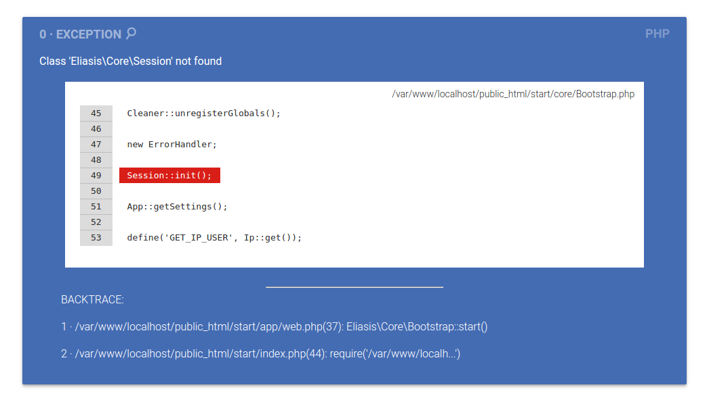
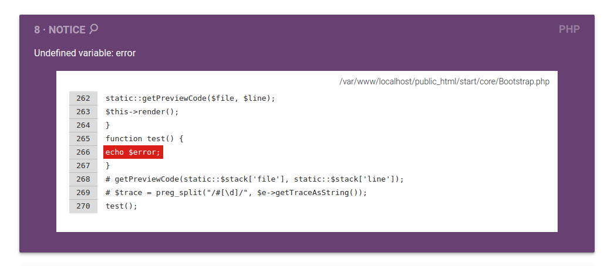
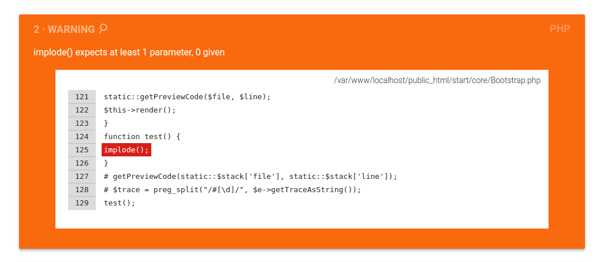

# PHP ErrorHandler library

[](https://packagist.org/packages/josantonius/errorhandler) [](https://packagist.org/packages/josantonius/errorhandler) [](https://packagist.org/packages/josantonius/errorhandler) [](https://packagist.org/packages/josantonius/errorhandler)

[Spanish version](README-ES.md)

PHP library for handling exceptions and errors.

---

- [Installation](#installation)
- [Requirements](#requirements)
- [Quick Start and Examples](#quick-start-and-examples)
- [Available Methods](#available-methods)
- [Images](#images)
- [Usage](#usage)
- [Tests](#tests)
- [Exception Handler](#exception-handler)
- [Contribute](#contribute)
- [Repository](#repository)
- [Author](#author)
- [Licensing](#licensing)

---

### Installation

The preferred way to install this extension is through [composer](http://getcomposer.org/download/).

To install PHP ErrorHandler library, simply:

    $ composer require Josantonius/ErrorHandler

### Requirements

This library is supported by PHP versions 5.6 or higher and is compatible with HHVM versions 3.0 or higher.

### Quick Start and Examples

To use this class, simply:

```php
require __DIR__ . '/vendor/autoload.php';

use Josantonius\ErrorHandler\ErrorHandler;
```
### Available Methods

Available methods in this library:

```php
ErrorHandler->error();
ErrorHandler->exception();
```

### Images






### Usage

Example of use for this library:

```php
<?php
require __DIR__ . '/vendor/autoload.php';

use Josantonius\ErrorHandler\ErrorHandler;

/* It is recommended to instantiate the class in a base file as the index.php */

new ErrorHandler;
```

### Tests 

To use the [test](tests) class, simply:

```php
<?php
$loader = require __DIR__ . '/vendor/autoload.php';

$loader->addPsr4('Josantonius\\ErrorHandler\\Tests\\', __DIR__ . '/vendor/josantonius/errorhandler/tests');

use Josantonius\ErrorHandler\Tests\ErrorHandlerTest;

```
Available test methods in this library:

```php
ErrorHandlerTest->testSProvokeException();
ErrorHandlerTest->testSProvokeWarning();
ErrorHandlerTest->testSProvokeNotice();
ErrorHandlerTest->testSProvokeUserError();
ErrorHandlerTest->testSProvokeUserNotice();
ErrorHandlerTest->testSProvokeUserWarning();
```

### Exception Handler

This library uses [exception handler](src/Exception) that you can customize.
### Contribute
1. Check for open issues or open a new issue to start a discussion around a bug or feature.
1. Fork the repository on GitHub to start making your changes.
1. Write one or more tests for the new feature or that expose the bug.
1. Make code changes to implement the feature or fix the bug.
1. Send a pull request to get your changes merged and published.

This is intended for large and long-lived objects.

### Repository

All files in this repository were created and uploaded automatically with [Reposgit Creator](https://github.com/Josantonius/BASH-Reposgit).

### Author

Maintained by [Josantonius](https://github.com/Josantonius/).

### Licensing

This project is licensed under **MIT license**. See the [LICENSE](LICENSE) file for more info.